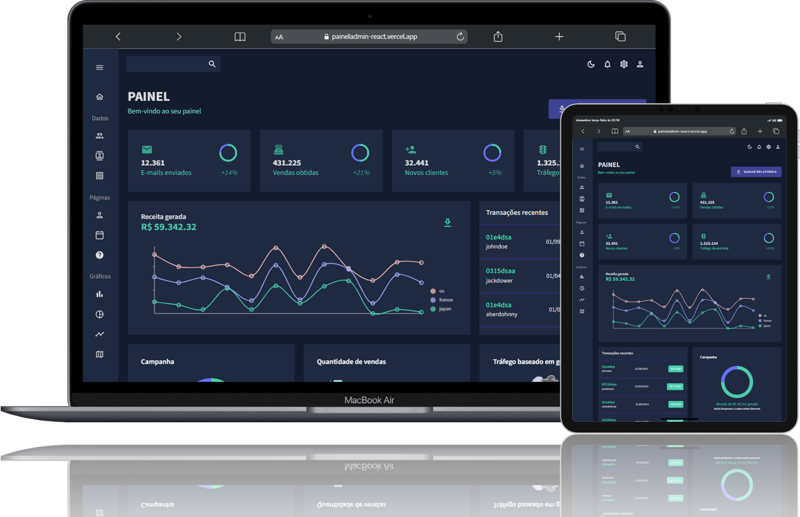
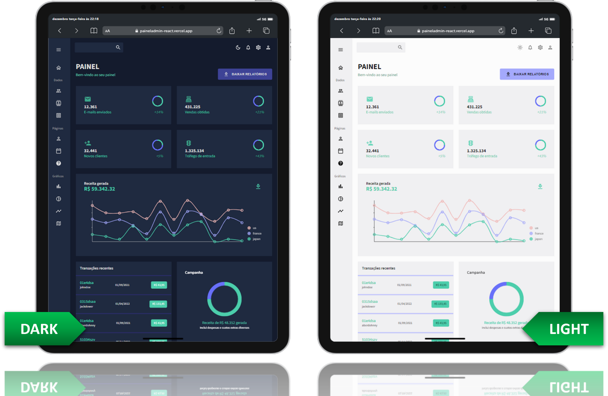

# Painel Admin React

<p align="center">
    
    <br />
    Home Page Screenshot
</p>

Check the app running: [Painel Admin React](https://paineladmin-react.vercel.app).

## Table of Contents

- [Installation](#installation)
- [Running the app](#running-the-app)
- [App Screenshots](#app-screenshots)

## Installation

Install the dependencies with the command:

```bash
npm install
```

## Running the App

This project was created with [Create React App](https://github.com/facebook/create-react-app). To run the app, execute the command:

```bash
npm start
```

The app will start running at [localhost:3000](http://localhost:3000) on your browser.

## App Screenshots

<p align="center">
    
    <br />
    Examples of tables and graphs
</p>
<br />
<p align="center">
    
    <br />
    Dark and Light mode
</p>
